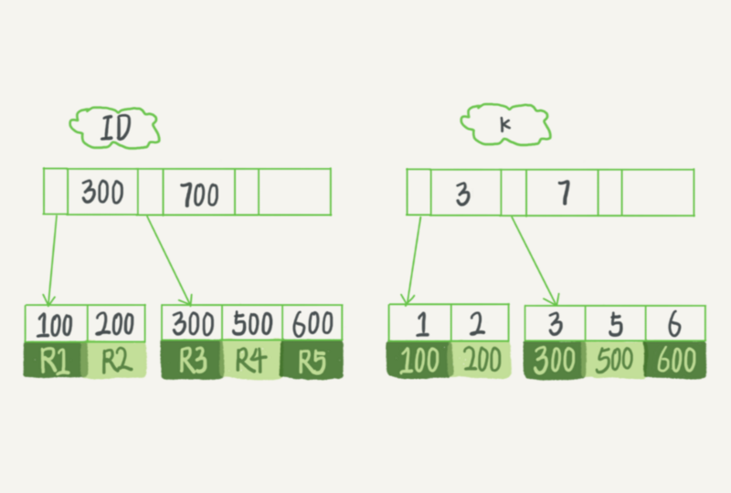

# 深入浅出索引

本文是在看极客时间《Mysql实战45讲》时记的笔记，整理下加深理解。

简单来说，数据库索引就是为了提高数据库查询的效率，就像书的目录一样，可以根据目录快速的找到其中的某一个知识点。

## 索引模型

- 哈希表
- 有序数组
- 搜索树

简单的介绍下以上三种模型：

==哈希表==是一种以键-值(key-value)存储的数据结构，我们只要输入待查找的key值，就可以找到其对应的值value，哈希的思路很简单，把值放在数组里，通过一个哈希函数把key换算成一个确定的位置，然后把value放在数组的这个位置。不可避免的情况下，多个Key值经过哈希运算会出现同一个值的情况，处理这种情况的一种方法是拉出一个链表。

由于哈希表内部的排序并不是递增的，所以新增元素的时候速度会很快，但缺点是因为不是有序的，**所以哈希表做区间查询的速度是很慢的。所以，哈希表这种结构只适用于只有等值查询的场景，比如Memcached以及其他Nosql引擎。**

==有序数组==在等值查询和范围查询场景中的性能都非常优秀。但是在需要更新数据的时候就很麻烦了，如果在中间插入一个记录就必须挪动后面所有的记录，成本太高。所以**有序数组只适用于静态存储引擎。**

N叉树在读写上的性能优点，以及适配磁盘的访问模式，已经被广泛应用于数据库引擎中了。

不管是哈希还是有序数组，或者 N 叉树，它们都是不断迭代、不断优化的产物或者解决方案。在我们心里要有个概念，数据库底层存储的核心就是基于这些数据模型的，每碰到一个新的数据库，我们都应先关注他的数据模型，这样才能从理论上分析出这个数据库的应用场景。

## InnoDB的索引模型

在InnoDB中，表都是根据主键顺序以索引的形式存放的，这种存储方式的表称为索引组织表。InnoDB使用了B+树索引模型，所以数据都是存储在B+树中的。

每一个索引在InnoDB里面都对应一颗B+树。

假设我们有一个主键列为ID的表，表中有字段K，并在K上有索引。

这个表的建表语句：

```sql
mysql> create table T(
id int primary key,
k int not null,
name varchar(16),
index (k))engine=InnoDB;
```

表中 R1~R5 的 (ID,k) 值分别为 (100,1)、(200,2)、(300,3)、(500,5) 和 (600,6),两棵树的示意图如下：



从图中我们可以看出来，根据叶子节点的内容，索引分为主键索引和非主键索引。

主键索引的叶子节点存放的是整行的数据，非主键索引的叶子节点存放的是主键的值。

根据上面的索引结构说明，我们可以得出一个问题，基于主键索引和普通索引的查询区别：

- 如果语句是`select * from T where ID = 500;`,即主键查询方式，则只需要搜索ID这颗B+树；
- 如果语句是`select * from T where k = 5;`,即普通索引查询方式，则需要先搜索k索引树，得到ID的值为500,再到ID索引树搜索一次，这个过程称为回表。

也就是说基于非主键索引查询会多扫描一次索引树。

## 索引维护

B+树为了维护索引的有序性，在插入新值的时候需要做必要的维护。

建表时，尽量保持有自增主键。每次插入一条新记录，都是追加操作，都不涉及到挪动其他记录，也不会触发叶子节点的分裂。

而有业务逻辑的字段做主键，则往往不容易保证有序插入。

同时主键的长度越小，普通索引的叶子节点就越小，普通索引占用的空间就越小。

所以从性能和存储空间来看，自增主键往往是更合理的选择。

## 覆盖索引

如果执行的语句是 `select ID from T where k between 3 and 5`，这时只需要查 ID 的值，而ID 的值已经在 k 索引树上了，因此可以直接提供查询结果，不需要回表。也就是说，在这个查询里面，索引 k 已经“覆盖了”我们的查询需求，我们称为覆盖索引。

**由于覆盖索引可以减少树的搜索次数，显著提升查询性能，所以使用覆盖索引是常用的性能优化手段。**

## 最左前缀原则

第一原则是，如果通过调整顺序，可以少维护一个索引，那么这个顺序往往就是需要优先考虑采用的。

其次考虑的就是空间，比如name 字段是比 age 字段大的 ，那我就建议你创建一个(name,age) 的联合索引和一个 (age) 的单字段索引。

## 索引下推

在Mysql5.6之前，只能从最左前缀查询到ID开始一个个回表，到主键索引上找出数据行，再对比字段值。

Mysql5.6之后，引入索引下推的优化，可以在遍历过程中，对索引中包含的字段先做判断，直接过滤掉不满足条件的记录，减少回表次数。

**总之在满足语句需求的情况下，尽量地减少访问资源是数据库设计的重要原则之一。我们在使用数据库的时候，尤其在设计表结构时，也要以减少资源消耗为目标。**

## 参考资料

极客时间《Mysql实战45讲》


[1]: /img/bVbn8sa